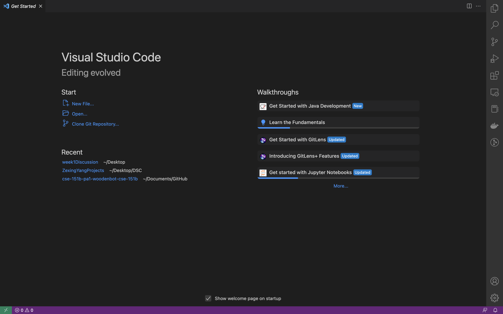
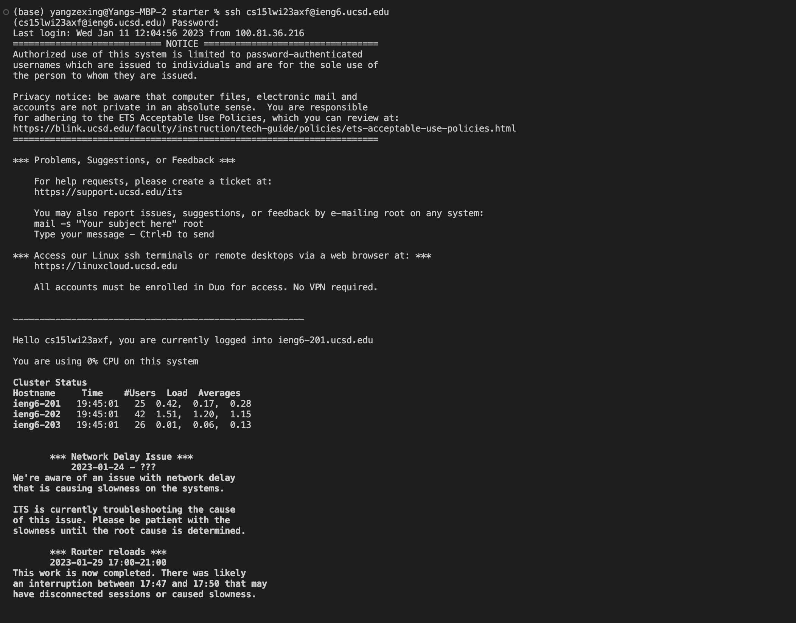
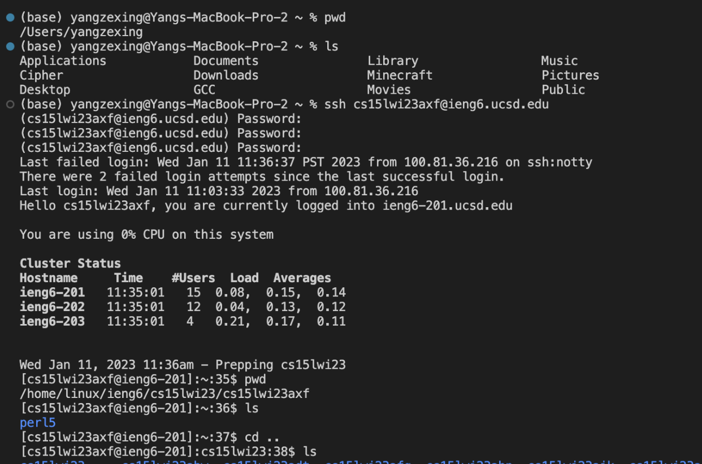
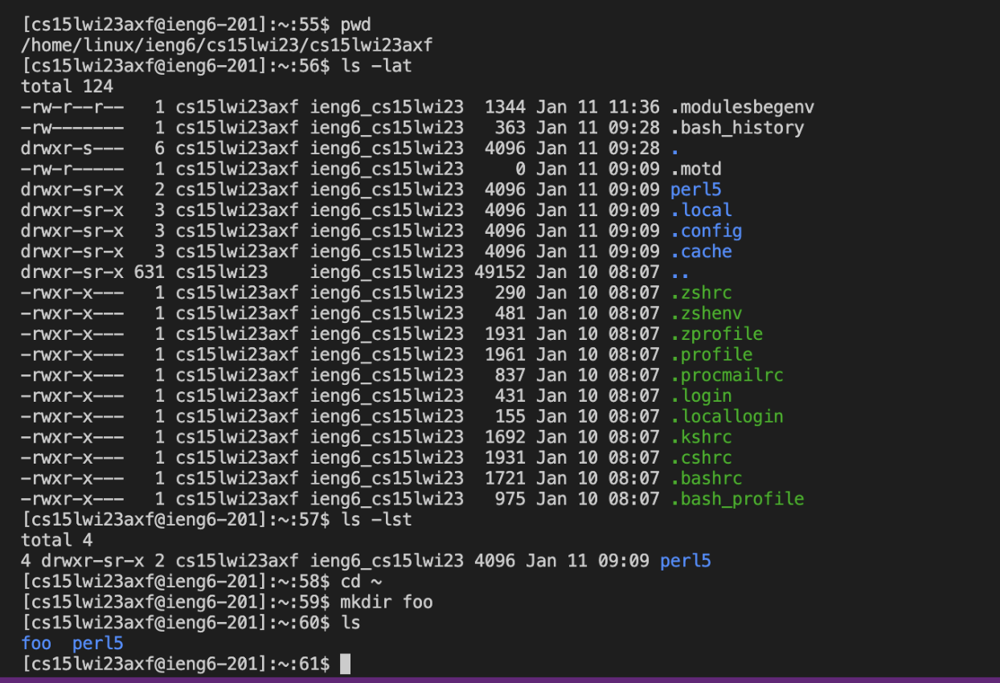
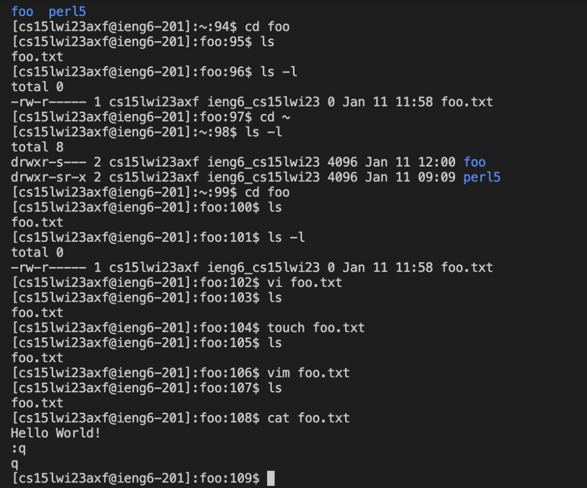
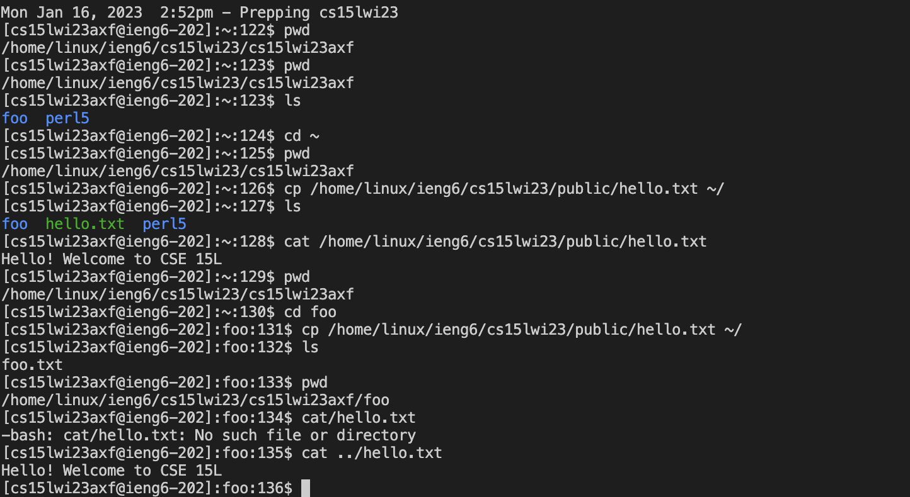

## CSE15L_Week1_lab_Zexing_Yang

## Installing VS Code
#(Wed 11:00 AM B260, Group 2 (Patrick’s Group))#

I have already downloaded visual studio before. Since I am using it all the time, I don't want to reinstall it.

## Remotely connecting
I was logging in to a remote computer using my username. Through the use of $ ssh cs15lwi23axf@ieng6.ucsd.edu, I was able to connect to the distant computer. It's not the first time I've logged in, and since the picture was taken when I repeated the login process as instructed, I didn't see the welcome message that should have appeared for new users.

#(Wed 11:00 AM B260, Group 2 (Patrick’s Group))#

The first few lines show the results of my local computer search. I then used SSH (Secure Shell) to log into cse15l account and tried some commands like pwd:print working directory and ls: file and directory listing

## Trying Some Commands
#(Wed 11:00 AM B260, Group 2 (Patrick’s Group))#

Ls -lat: list directories with three options: l :showing file information    a: all   t: sort by time
Mkdir : make a directory called foo

Then I use touch foo.txt to create a new text file under foo directory and use vim to open and edit foo.txt 

cp is copy and cat prints the content of the txt file

Thank you for reviewing this lab report!
