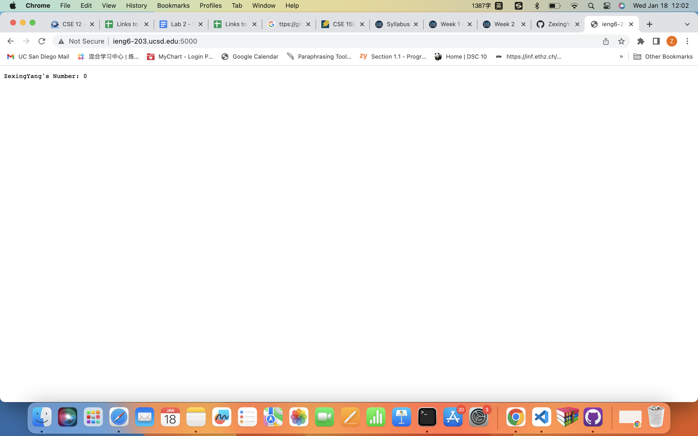
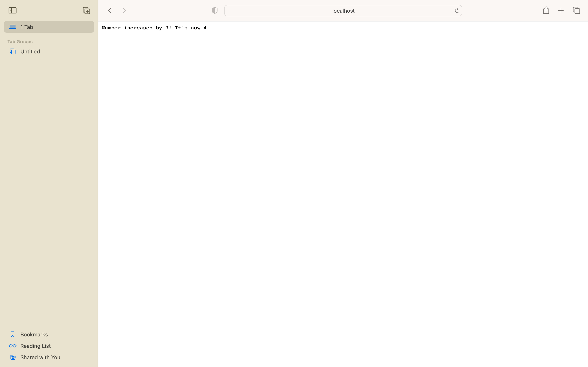

## CSE15L_Week2&3_lab_Zexing_Yang

## Part 1 Search Engine
#Wed 11:00 AM B260, Group 2, Serpentmarsh


## Part 2 One bug from Lab3
#Wed 11:00 AM B260, Group 2, Serpentmarsh

A Test induce failure
```
{
@Test 
public void testReverseInPlace() {
	int[] input1 = { 3 };
	ArrayExamples.reverseInPlace(input1);
	assertArrayEquals(new int[]{ 3 }, input1);
}

```
			


Doesn't induce failure if we have only one element
```
{
@Test 
public void testReverseInPlace() {
	int[] input1 = {2};
	ArrayExamples.reverseInPlace(input1);
	assertArrayEquals(new int[]{ 2}, input1);
}

```
			
		


The symptom seems to be that the last index, here length 3 array at index two gives the wrong output.


When we look up the code, it just swap first and last elements without temperary variable, leading some elements not changed at all. The bug is that we should /* for(int i = 0; i < (arr.length)/2; i += 1) {  //abcd to dcba
      int temp = arr[i];
      arr[i] = arr[arr.length - i - 1];
      arr[arr.length-i-1] = temp;
    } */  

## Part 3 New Knowledge
#Wed 11:00 AM B260, Group 2, Serpentmarsh


I didn't know Building and Running the Server before and it amazes me when I could build a server that perform simple calculations show on the screen.



I also noticed the difference between localhost and ieng6-203: localhost is a hostname that refers to the current device used to access it while ieng-203 is my ucsd remote computer.
