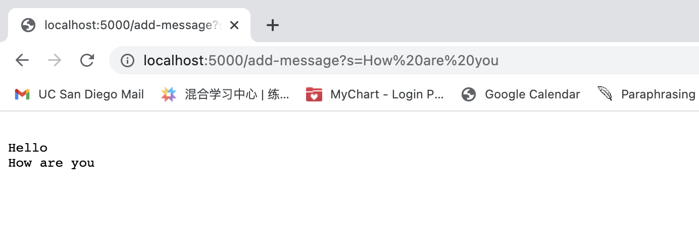

## CSE15L_Week2&3_lab_Zexing_Yang

## Part 1 Search Engine
#Wed 11:00 AM B260, Group 2, Serpentmarsh

Both url.getPath() and url.getQuery() are called. Here, I use substring method and indexOf to extract the portion of query as the string I wish to return.


The string is "Hello" here and runningstring is "Hello"


The string is "How are you" here and the runningstring is "Hello" + '\n' + "How are you"


I wrote the code and revise it by serching string methods and even asking chatGPT to debug my code because I thought the demo in class today interesting. My prompt is: why is my code not working as expected to keep track of strings and typing in my handleRequest.
```
import java.io.IOException;
import java.net.URI;

 public class StringServer implements URLHandler{
    //The final return value initialize with empty string
    private static String runningString = "";
    //Same code from class NumberServer to initialize a server
    public static void main(String[] args) throws IOException {
        if(args.length == 0){
            System.out.println("Missing port number! Try any number between 1024 to 49151");
            return;
        }

        int port = Integer.parseInt(args[0]);

        Server.start(port, new StringServer());
    }
    //It works! but could not keep track of strings
    /* public String handleRequest(URI url) {
        String returnstring = "";
        System.out.println("Path: " + url.getPath());
        if (url.getPath().contains("/add-message")) {
            String string = (String)url.getQuery().substring(url.getQuery().indexOf('=')+1);
            return returnstring + string + "\n";
        }
        else{
            return "404 Not Found!";
        }
    }  */
    
    @Override
    public String handleRequest(URI url) {
        System.out.println("Path: " + url.getPath());
        if (url.getPath().contains("/add-message")) {
            String query = url.getQuery();
            if (query != null) {
                int index = query.indexOf("=");
                if (index != -1) {
                    String string = query.substring(index + 1);
                    runningString += "\n" + string;
                }
            }
            return runningString;
        } else {
            return "404 Not Found!";
        }
    }
}
```


## Part 2 One bug from Lab3
#Wed 11:00 AM B260, Group 2, Serpentmarsh


A Test induce failure
```

@Test 
public void testReverseInPlace() {
	int[] input1 = { 1, 2, 3 };
	ArrayExamples.reverseInPlace(input1);
	assertArrayEquals(new int[]{ 3, 2, 1 }, input1);
}

```
			


Doesn't induce failure if we have only one element
```

@Test 
public void testReverseInPlace() {
	int[] input1 = {2};
	ArrayExamples.reverseInPlace(input1);
	assertArrayEquals(new int[]{ 2}, input1);
}

```
			
		


The symptom seems to be that the last index, here length 3 array at index 2 gives the wrong output given what the junit claims. The symptom is that later elemets repeat earlier elemnts and the swap fails. 

However, with one element, the code still works!


When we look up the code, it just swap first and last elements without temperary variable, leading some elements not changed at all. The bug is that we should 
```
Original code with bug:
```
static void reverseInPlace(int[] arr) {
    for(int i = 0; i < arr.length; i += 1) {
      arr[i] = arr[arr.length - i - 1];
    }
  }
```
Correct code using temp and modifying for loop
public class ArrayExamples {
// Changes the input array to be in reversed order
	static void reverseInPlace(int[] arr) {
	//Correct below
    		for(int i = 0; i < (arr.length)/2; i += 1) {  //abcd to dcba
      			int temp = arr[i];
      			arr[i] = arr[arr.length - i - 1];
      			arr[arr.length-i-1] = temp;
    		}		  
	}
}
```


## Part 3 New Knowledge
#Wed 11:00 AM B260, Group 2, Serpentmarsh


I didn't know Building and Running the Server before and it amazes me when I could build a server that perform simple calculations show on the screen.


I also noticed the difference between localhost and ieng6-203: localhost is a hostname that refers to the current device used to access it while ieng-203 is my ucsd remote computer.
