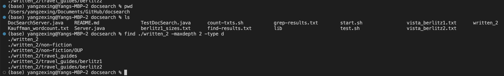
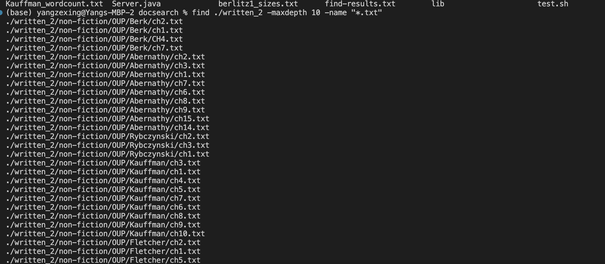
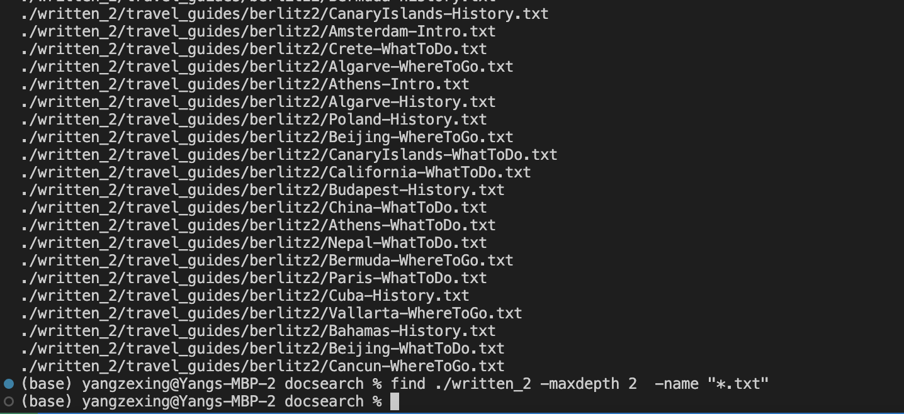
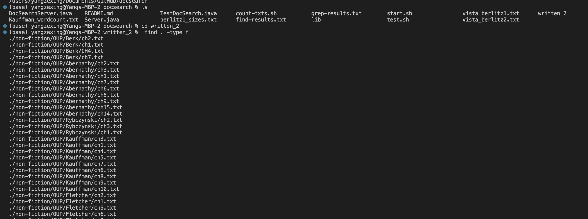
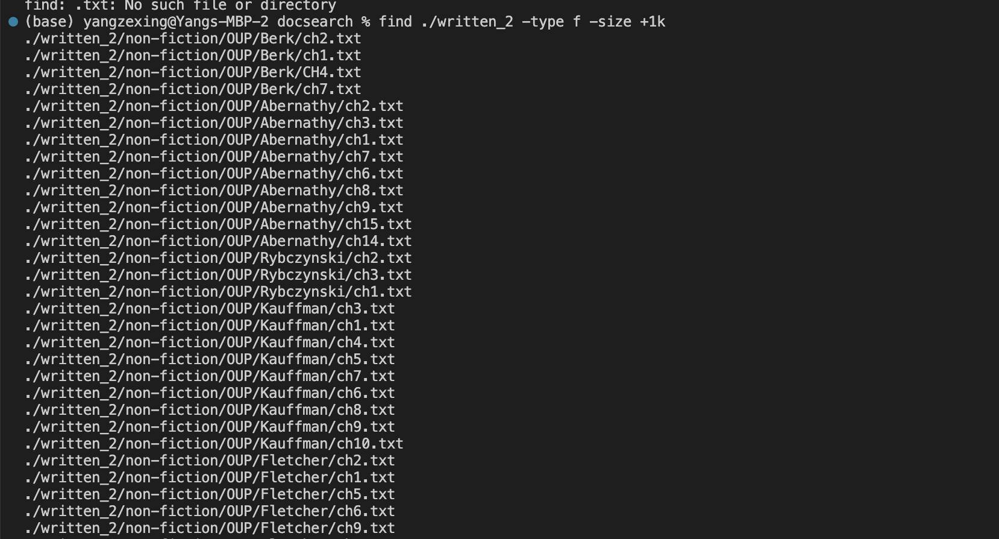
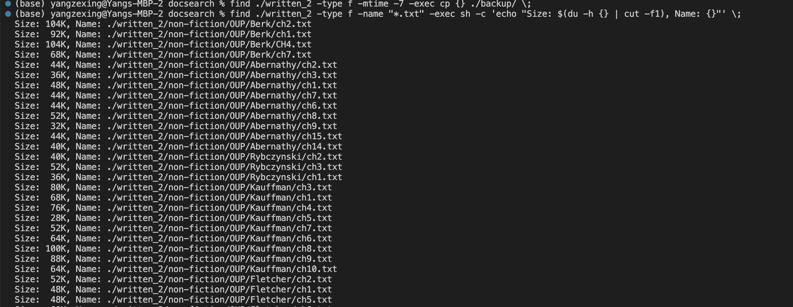
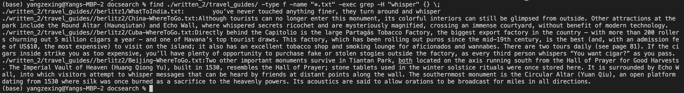

## CSE15L_Lab_Report_3_Zexing_Yang
## Part 1 find -maxdepth
#Wed 11:00 AM B260, Group 2, Serpentmarsh

## Part 1 find -type
#Wed 11:00 AM B260, Group 2, Serpentmarsh

## Part 1 find -size
#Wed 11:00 AM B260, Group 2, Serpentmarsh
The -size option allows you to search for files that match a specific size.

Example 1: Find all files in the ./written_2 directory that are larger than 1 kilobyte: most txt files are bigger than 1kb

Example 1: Find all files in the ./written_2 directory that are smaller than 1 kilobyte: there are only two

## Part 1 find -exec
#Wed 11:00 AM B260, Group 2, Serpentmarsh

In this illustration, the size of each file is obtained using the du command, and the size value is extracted using the cut command.
After that, the console is printed with the name and size of each file. and. 
The -h option of du instructs du to output file sizes in a more legible format, such as "1.5K" rather than "1536," 
and stands for "human-readable".echo is a command in the shell that simply outputs its arguments to the terminal. 
In the context of the command you provided, echo is used to display the result of the sh -c command which is the string "Size: <size>, Name: <filename>". 
The <size> and <filename> are obtained by the du and cut commands respectively.

The command that is supplied to exec must be surrounded in quotes and must end with a semicolon (;).
By doing so, you're informing locate that the command has completed, and it should continue on to the next file.

This command will search for all files with the .pdf extension in the documents directory and its subdirectories, 
and then it will execute the grep command on each file that matches the pattern. 
The grep command will search for the keyword "keyword" in the file and print out any lines that contain the keyword, 
along with the name of the file that the lines came from.
