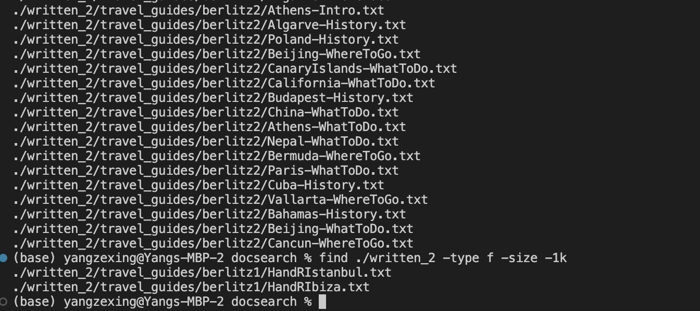

## CSE15L_Lab_Report_3_Zexing_Yang
## Part 1 find -maxdepth
#Wed 11:00 AM B260, Group 2, Serpentmarsh

I used site https://www.geeksforgeeks.org/mindepth-maxdepth-linux-find-command-limiting-search-specific-directory/ and ChatGpt

The -maxdepth option is useful when I want to limit the depth of the search, i.e., 
how many levels of subdirectories should be searched. Here I search directories with depth 2 in written2

Here I search txt files with depth 10 in written2 so it basically shows all txt files in written2 because they have depth less than 10
Notice my current directory is from Github docsearch as I continue to work on week4 repo.

It just shows that there's nothing.

## Part 2 find -type
#Wed 11:00 AM B260, Group 2, Serpentmarsh
I used site https://www.tecmint.com/35-practical-examples-of-linux-find-command/ and ChatGpt

The -type option is useful when you want to filter the results by the type of file, 
such as directories (-type d) or regular files (-type f). Here I specify name of directories I wish to see.

Since . means my currecnt directory which is written2, I would have all files in written2 using type f

## Part 3 find -size
#Wed 11:00 AM B260, Group 2, Serpentmarsh
I used site https://www.tecmint.com/35-practical-examples-of-linux-find-command/
The -size option allows you to search for files that match a specific size.

Find all files in the ./written_2 directory that are larger than 1 kilobyte: most txt files are bigger than 1kb

Find all files in the ./written_2 directory that are smaller than 1 kilobyte: there are only two

## Part 4 find -exec
#Wed 11:00 AM B260, Group 2, Serpentmarsh
I used ChatGPT and site https://www.geeksforgeeks.org/exec-command-in-linux-with-examples/ 

In this illustration, the size of each file is obtained using the du command, and the size value is extracted using the cut command.
The -h option of du instructs du to output file sizes in a more legible format, such as "1.5K" rather than "1536," 
and stands for "human-readable".echo is a command in the shell that simply outputs its arguments to the terminal. 
In the context, echo is used to display the result of the sh -c command which is the string "Size: <size>, Name: <filename>". 
The <size> and <filename> are obtained by the du and cut commands respectively.

  
The command below will search for all files with the .txt extension in the directory within written2 and its subdirectories, 
and then it will execute the grep command on each file that matches the pattern. 
The grep command will search for the keyword "whisper" in the file and print out any lines that contain the keyword, 
along with the name of the file that the lines came from.

  Thanks you!
