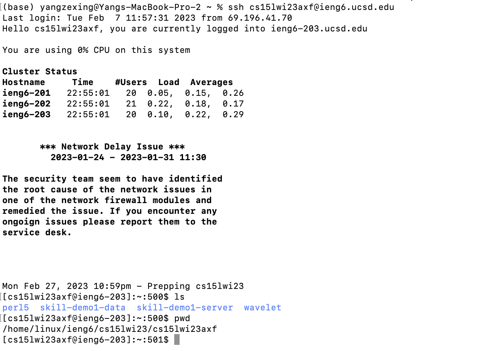
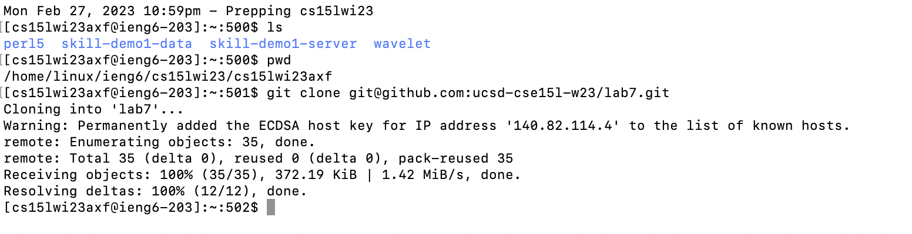
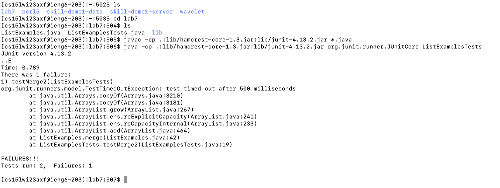
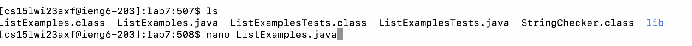
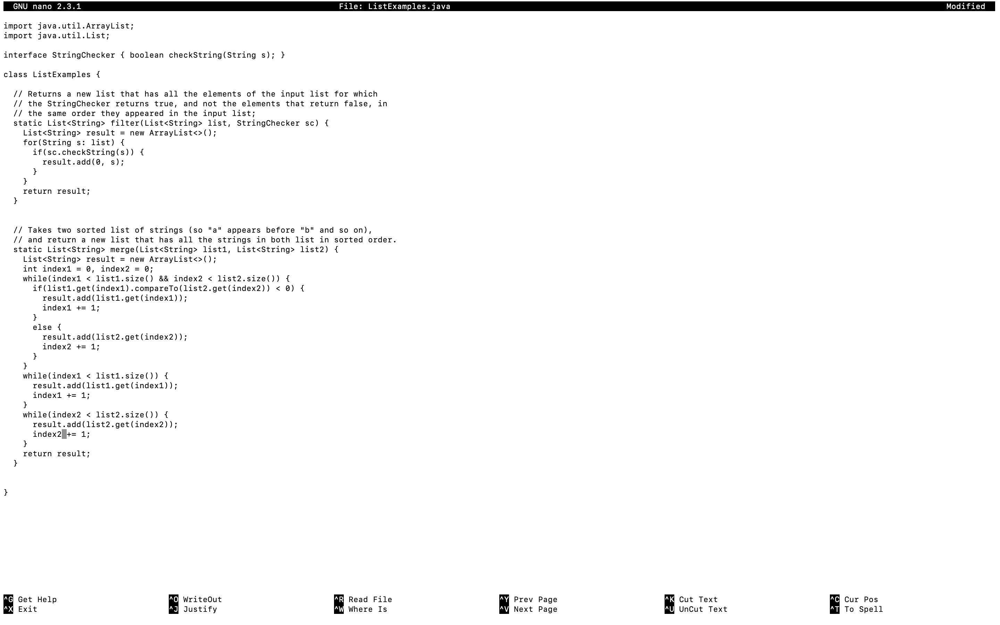
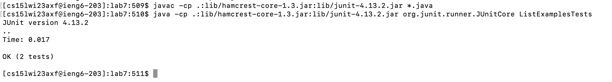
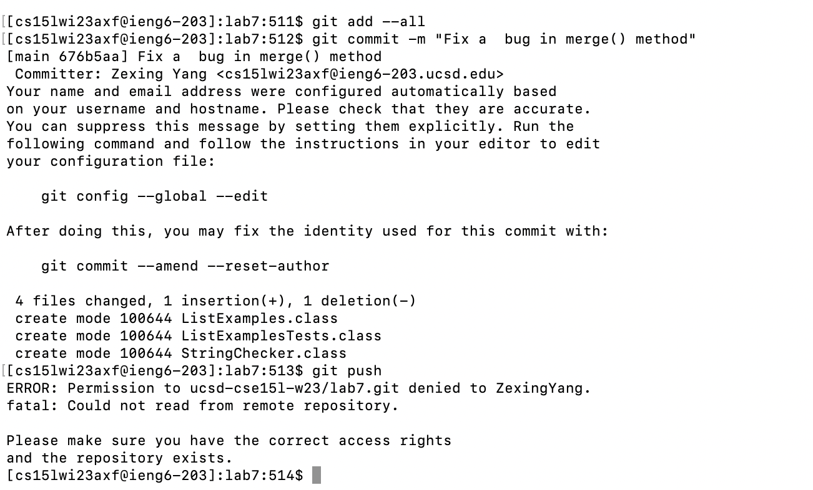

## CSE15L_Lab_Report_4_Zexing_Yang

## Log into ieng6
#Wed 11:00 AM B260, Group 2, Serpentmarsh

I type in ssh command with my account and hit `<enter>` to login as I have set "password free" in lab

 
 

## Clone your fork of the repository from your Github account
#Wed 11:00 AM B260, Group 2, Serpentmarsh

 I nevigate to github and use Command-C to copy and Command-V to paste the ssh link instead of the usual http link

 
 
## Run the tests, demonstrating that they fail
#Wed 11:00 AM B260, Group 2, Serpentmarsh

I use Command-C to copy and Command-V to paste javac -cp .:lib/hamcrest-core-1.3.jar:lib/junit-4.13.2.jar *.java 
Then I hit `<enter>`
I use Command-C to copy and Command-V to paste java -cp .:lib/hamcrest-core-1.3.jar:lib/junit-4.13.2.jar org.junit.runner.JUnitCore ListExamplesTests
Then I hit `<enter>`

 
 
## Edit the code file to fix the failing test 
#Wed 11:00 AM B260, Group 2, Serpentmarsh

 I used `<tab>` to auto complete the file name

 I use cursor to move to index2 (previously index1) and use delete and typing to modify the code. Then I press Ctrl+O to save the changes. I Press `<enter>` to confirm the same file name and press Ctrl+X to exit nano.

## Run the tests, demonstrating that they now succeed
#Wed 11:00 AM B260, Group 2, Serpentmarsh

I use Command-C to copy and Command-V to paste javac -cp .:lib/hamcrest-core-1.3.jar:lib/junit-4.13.2.jar *.java 
Then I hit `<enter>`
I use Command-C to copy and Command-V to paste java -cp .:lib/hamcrest-core-1.3.jar:lib/junit-4.13.2.jar org.junit.runner.JUnitCore ListExamplesTests
Then I hit `<enter>`

 
 
## Commit and push the resulting change to your Github account (you can pick any commit message!)
#Wed 11:00 AM B260, Group 2, Serpentmarsh

  I just enter following commands on my keyboard 
 `git add --all`: stage all changes
 `git commit -m "Fix a  bug in merge() method"`: I add one sentence to comment where is the bug
 `git add --all`: add
 `git push`: Pushes your changes to the default remote branch (usually origin/main)
 
 Thanks for watching!
