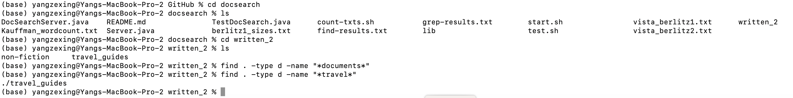
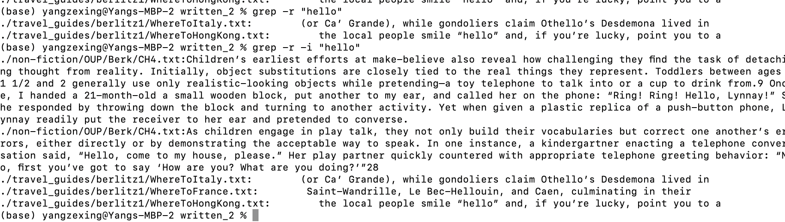

## CSE15L_Lab_Report_5_Zexing_Yang
## Continue on lab report 3
#Wed 11:00 AM B260, Group 2, Serpentmarsh

I used site https://linuxcommand.org/lc3_man_pages/grep1.html and ChatGpt

`find . -type d -name '*ber*'`will find all files in the current directory and its subdirectories.
I choose this one to have two matches

Find all files in the current directory and its subdirectories that have the word "travel" in their name:

Since last time I focus on find, this lab I will explore grep. Similar to skill-demo1, 
`grep -r "hello" .` find all files in the current directory and its subdirectories that contain the word "hello" in them.

 To perform a case-insensitive search, I can use the -i option: `grep -r -i "hello"`
 I notice that `grep -r "hello" .` and `grep -r "hello" works the same as we go to current as default

 
 
 
 
 `grep -i "History" IntroGreek.txt` would search for the word "history" in a case-insensitive manner in the IntroGreek.txt.

`grep -v "History" IntroGreek.txt` would search for lines in IntroGreek.txt that do not contain the word "History" 
as v represents "Invert" I guess from 

Thanks for watching!

